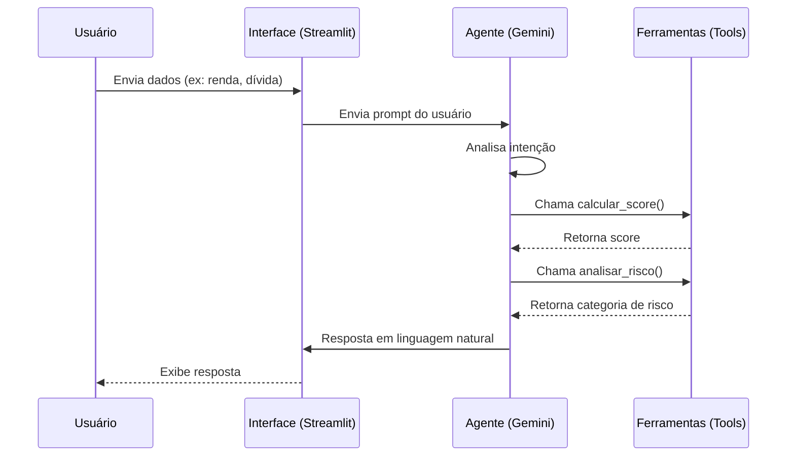

# Sistema de Análise de Risco de Crédito com Google ADK

Este projeto demonstra a criação de um agente de Inteligência Artificial para análise de risco financeiro (Credit Score) utilizando o Google Agent Development Kit (ADK) e Python.

## Visão Geral

O sistema consiste em um agente inteligente capaz de:
1.  Receber informações financeiras do usuário (renda, dívidas, histórico).
2.  Calcular um score de crédito utilizando uma ferramenta personalizada.
3.  Analisar o risco associado ao score calculado.
4.  Fornecer uma recomendação final em linguagem natural.

## Arquitetura

O projeto segue uma arquitetura modular:

*   **agent.py**: Gerencia a interação com o modelo Gemini e a orquestração das ferramentas.
*   **tools.py**: Contém a lógica de negócio determinística (cálculo de score e regras de risco).
*   **app.py**: Interface de usuário web construída com Streamlit.

### Diagrama de Sequência



## Pré-requisitos

*   Python 3.10 ou superior.
*   Uma chave de API do Google (Google AI Studio).

## Instalação

1.  Clone este repositório ou baixe os arquivos.
2.  Instale as dependências necessárias:

```bash
pip install google-generativeai streamlit
```

## Como Executar

1.  Navegue até o diretório do projeto:

```bash
cd credit_score_adk
```

2.  Execute a aplicação Streamlit:

```bash
streamlit run app.py
```

3.  A interface abrirá no seu navegador.
4.  Insira sua **Google API Key** na barra lateral.
5.  Interaja com o agente no chat.

## Exemplo de Uso

**Usuário**: "Analise o crédito para um cliente com renda de R$ 5.000,00, dívida total de R$ 1.200,00 e histórico de pagamento bom."

**Agente**: "Com base nos dados fornecidos:
*   O score calculado é **630**.
*   A classificação de risco é **Médio Risco**.

**Recomendação**: Aprovar crédito com taxas padrão. Solicitar comprovante de renda adicional se necessário."

## Estrutura de Arquivos

*   `agent.py`: Lógica do agente.
*   `tools.py`: Funções de cálculo.
*   `app.py`: Interface gráfica.
*   `README.md`: Documentação do projeto.
